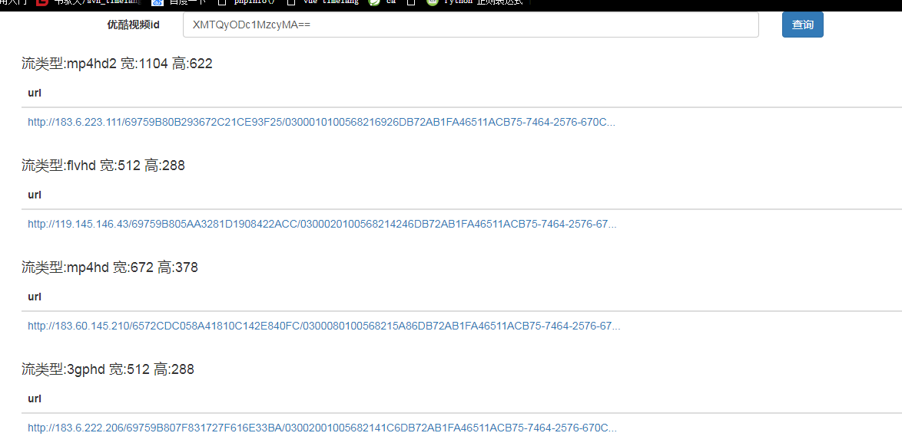

# 解析优酷视频地址
    使用php解析优酷网址视频地址,2018/3/23 更新

## 项目结构

只看`new`目录下的就可以了，其它的没意义，都是参考用的

## 使用方法
```
require_once "YoukuVideo.php";
$youkuVideo = new YoukuVideo('XMzQ3ODQ0OTA2MA==');
$json = $youkuVideo->get_json();
var_dump($json)
```
$json 是一个array, 优酷返回来的视频info，有很多关于视频的信息，按需处理吧

## 整合

### 整合到CI框架
复制`new/YoukuVideo.php`到library目录上，根据框架的文档调用这个类
    
### 整合到ThinkPHP
就一个`new/YoukuVideo.php`文件


## 例子 new/index.php (分析下载链接)

