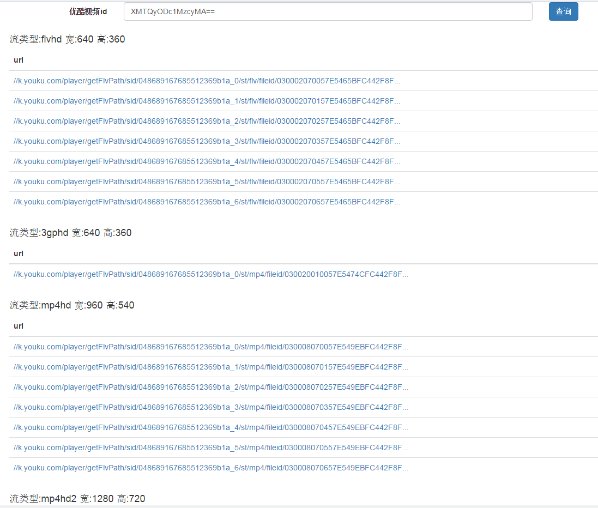
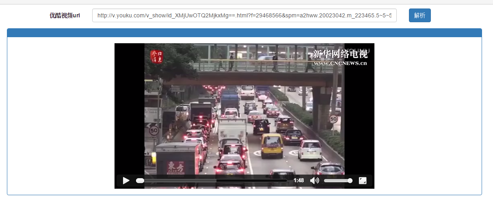

# 解析优酷网站视频地址
        使用php解析优酷网址视频地址,项目有时效性,欢迎大家fork,共同更新

## 项目结构

文件夹

- main  (项目主要目录,访问index.php)
- Requests-master  (引用的github的项目,封装了一些curl)
- js  (内下载了优酷的视频获取js,并且进行了反混淆,还有一些php测试加密算法)
- parse  (暂时未用到)
- test  (一些简单的测试)
- video-url-parser-master(参考了一些代码)
- youkuvod-master(参考了一些代码)

## 使用方法
```
$vid = "XMTg4MjI4MjY1Mg==";

require_once "class/VideoInfo.php";
$videoInfo = new VideoInfo($vid);

$streams = $videoInfo->getStreams();
foreach ($streams as $stream){
    if ($stream->stream_type=="3gphd") {//取3gphd流的视频
        $urls = $videoInfo->getVideoSrcs($stream);
        break;
    }
}
var_dump($urls);
```
- $vid是优酷视频id
测试的视频网址是 [http://m.youku.com/video/id_XMTQyODc1MzcyMA==.html](http://m.youku.com/video/id_XMTQyODc1MzcyMA==.html)

- $videoInfo->getStreams()
返回一个视频流数组,一个视频流对象对应接口返回的json,具体可以参考 [原理](#principle),优酷的视频流有flv, mp4hd, mp4hd2, mp4hd3, 3gphd, 3gp

- $urls = $videoInfo->getVideoSrcs($stream)
传入视频流对象,返回一个url数组,包含了所有视频分段,然后你就可以用这些视频地址了

- 以上例子的作用是找到视频流为3gphd的视频,提取它所有分段的url

## 其它配置
- main/Constants.php 可以修改请求json时候的Host, UserAgent, Cookie等,
其中Cookies可以复制你的浏览器访问优酷时的cookie,cookie对获得正确的json是很有作用的,否则提取的视频会提示403Forbidden

## 例子 main/example1.php (分析下载链接)




## 例子 main/example2.php (视频去广告播放)



## 例子 main/example3.php (视频去广告播放，videoJs分段)

## <span id="principle">原理</span>
- 优酷接口:获取视频json的url [http://play-ali.youku.com/play/get.json?vid=XMTQyODc1MzcyMA==&ct=12&callback=asd](http://play-ali.youku.com/play/get.json?vid=XMTQyODc1MzcyMA==&ct=12&callback=asd)

返回的json如下:
```
{
    "cost": 0.01900000125169754,
    "data": {
        "preview": {
            "thumb": [
                "http://g1.ykimg.com/052100015682171A6C28916FB00DBE8C"
            ],
            "timespan": "6000"
        },
        "controller": {
            "continuous": false,
            "share_disable": false,
            "download_disable": false,
            "play_mode": 1,
            "like_disabled": false,
            "stream_mode": 1,
            "circle": false,
            "app_disable": false,
            "html5_disable": false,
            "video_capture": true
        },
        "playlog": {
            "lastpoint": "0"
        },
        "video": {
            "category_letter_id": "f",
            "img_hd": "https://r1.ykimg.com/05420408568216A36A0A4F0472FB3531",
            "upload": "normal",
            "privacy": "anybody",
            "source": 1,
            "title": "【迪迦奥特曼MMD】迪迦来砸店了",
            "restrict": 0,
            "type": [
                "bullet",
                "interact"
            ],
            "userid": 716307014,
            "encodeid": "XMTQyODc1MzcyMA==",
            "tags": [
                "舞蹈",
                "奥特曼",
                "砸店",
                "迪迦奥特曼",
                "MMD",
                "凹凸曼",
                "奥特曼MMD"
            ],
            "seconds": "206.00",
            "category_id": 95,
            "ctype": "UGC",
            "published_time": "2015-12-29 13:09:00",
            "logo": "https://r1.ykimg.com/05410408568216A36A0A4F0472FB3531",
            "subcategories": [
                {
                    "name": "同人",
                    "id": "3066"
                }
            ],
            "username": "韦驮天车手"
        },
        "network": {
            "country_code": "CN",
            "area_code": "442000",
            "dma_code": "4134"
        },
        "security": {
            "encrypt_string": "NwXYSAUfL7LY0/fB9OJxBInz6xNv1wXPWxk=",
            "ip": 242476035
        },
        "stream": [
            {
                "audio_lang": "default",
                "milliseconds_video": 206400,
                "milliseconds_audio": 206565,
                "transfer_mode": "http",
                "segs": [
                    {
                        "path": "http://k.youku.com/player/getFlvPath/sid/048681992270112f97b0b_00/st/mp4/fileid/03002001005682141C6DB72AB1FA46511ACB75-7464-2576-670C-FCC3FFA9D490?k=78fff294fdc57c38261f8283&hd=1&myp=0&ts=207&sign=ec1eab9ba3175dad26a6977cd236743f",
                        "size": "7792478",
                        "total_milliseconds_video": "206400",
                        "total_milliseconds_audio": "206565",
                        "key": "78fff294fdc57c38261f8283&sign=ec1eab9ba3175dad26a6977cd236743f",
                        "fileid": "03002001005682141C6DB72AB1FA46511ACB75-7464-2576-670C-FCC3FFA9D490"
                    }
                ],
                "size": 7792478,
                "subtitle_lang": "default",
                "media_type": "standard",
                "drm_type": "default",
                "stream_type": "3gphd",
                "width": 512,
                "logo": "youku",
                "height": 288
            },
            {
                "audio_lang": "default",
                "milliseconds_video": 206400,
                "milliseconds_audio": 206611,
                "transfer_mode": "http",
                "segs": [
                    {
                        "path": "http://k.youku.com/player/getFlvPath/sid/048681992270112f97b0b_00/st/flv/fileid/0300020100568214246DB72AB1FA46511ACB75-7464-2576-670C-FCC3FFA9D490?k=d887eeb6d5d1b29e261f8283&hd=0&myp=0&ts=207&sign=ec1eab9ba3175dad26a6977cd236743f",
                        "size": "10815318",
                        "total_milliseconds_video": "206400",
                        "total_milliseconds_audio": "206611",
                        "key": "d887eeb6d5d1b29e261f8283&sign=ec1eab9ba3175dad26a6977cd236743f",
                        "fileid": "0300020100568214246DB72AB1FA46511ACB75-7464-2576-670C-FCC3FFA9D490"
                    }
                ],
                "size": 10815318,
                "subtitle_lang": "default",
                "media_type": "standard",
                "drm_type": "default",
                "stream_type": "flvhd",
                "width": 512,
                "logo": "youku",
                "height": 288
            },
            {
                "audio_lang": "default",
                "milliseconds_video": 206292,
                "milliseconds_audio": 206611,
                "transfer_mode": "http",
                "segs": [
                    {
                        "path": "http://k.youku.com/player/getFlvPath/sid/048681992270112f97b0b_00/st/mp4/fileid/0300080100568215A86DB72AB1FA46511ACB75-7464-2576-670C-FCC3FFA9D490?k=e8fbd7cdd379131c282c1d1e&hd=1&myp=0&ts=207&sign=ec1eab9ba3175dad26a6977cd236743f",
                        "size": "14199195",
                        "total_milliseconds_video": "206292",
                        "total_milliseconds_audio": "206611",
                        "key": "e8fbd7cdd379131c282c1d1e&sign=ec1eab9ba3175dad26a6977cd236743f",
                        "fileid": "0300080100568215A86DB72AB1FA46511ACB75-7464-2576-670C-FCC3FFA9D490"
                    }
                ],
                "size": 14199195,
                "subtitle_lang": "default",
                "media_type": "standard",
                "drm_type": "default",
                "stream_type": "mp4hd",
                "width": 672,
                "logo": "youku",
                "height": 378
            },
            {
                "audio_lang": "default",
                "milliseconds_video": 206292,
                "milliseconds_audio": 206611,
                "transfer_mode": "http",
                "segs": [
                    {
                        "path": "http://k.youku.com/player/getFlvPath/sid/048681992270112f97b0b_00/st/flv/fileid/0300010100568216926DB72AB1FA46511ACB75-7464-2576-670C-FCC3FFA9D490?k=c2100f6cc1e88b71261f8283&hd=2&myp=0&ts=207&sign=ec1eab9ba3175dad26a6977cd236743f",
                        "size": "30994546",
                        "total_milliseconds_video": "206292",
                        "total_milliseconds_audio": "206611",
                        "key": "c2100f6cc1e88b71261f8283&sign=ec1eab9ba3175dad26a6977cd236743f",
                        "fileid": "0300010100568216926DB72AB1FA46511ACB75-7464-2576-670C-FCC3FFA9D490"
                    }
                ],
                "size": 30994546,
                "subtitle_lang": "default",
                "media_type": "standard",
                "drm_type": "default",
                "stream_type": "mp4hd2",
                "width": 1104,
                "logo": "youku",
                "height": 622
            }
        ],
        "uploader": {
            "uid": "UMjg2NTIyODA1Ng==",
            "reason": "吸引更多观众，为更多的关注做服务，打出自己的品牌！使自己的视频做的更好，更出色。",
            "fan_count": 160465,
            "subscription": 1,
            "avatar": {
                "small": "https://static.youku.com/user/img/avatar/30/42.jpg",
                "big": "https://static.youku.com/user/img/avatar/80/42.jpg",
                "middle": "https://static.youku.com/user/img/avatar/50/42.jpg",
                "large": "https://static.youku.com/user/img/avatar/310/42.jpg"
            },
            "show_brand": 0,
            "certification": true,
            "username": "韦驮天车手",
            "homepage": "http://i.youku.com/u/UMjg2NTIyODA1Ng=="
        },
        "id": 357188430,
        "user": {
            "uid": "716307014",
            "vip": false
        }
    },
    "e": {
        "code": 0,
        "provider": "hsfprovider",
        "desc": ""
    }
}
```

- 获取视频地址的接口
  优酷的js代码在 [http://static.youku.com/h5/player/embed/unifull/unifull_.js](http://static.youku.com/h5/player/embed/unifull/unifull_.js)

```
相关:
YKP.userCache{
a1:"4"
a2:"1"
sid:"048677541290712f09e4e"
token:"0539"
}

j = {
flv: 0,
flvhd: 0,
mp4hd: 1,
mp4hd2: 2,
mp4hd3: 3,
"3gphd": 0,
"3gp": 0
}

l = {
flv: "flv",
mp4hd: "mp4",
mp4hd2: "flv",
mp4hd3: "flv",
"3gphd": "mp4",
"3gp": "flv",
flvhd: "flv"
}

url:
/player/getFlvPath/sid/+（YKP.userCache.sid + "_" + n分段,从0开始）+
"/st/" + （mp4） + "/fileid/" + (0300200100589DD73B9C87080D48DD7C70E103-2BE5-1CD4-262A-8358D4F07B36) +
"?K=" + p +
"&hd=" + (上面j的值) +
"&myp=0&ts=" + （o，时长是一个值，单位秒） +
"&ypp=0" + （q，"&ymovie=1"或者&ypremium=1）,
"&ep=" + (加密算法),
"&ctype=12",
"&ev=1",
"&token=" + (YKP.userCache.token),
"&oip=" + (YK.v.data.security.ip,可以不写),
(f ? "/password/" + f : "") 可以不写
(g ? g : ""),可以不写

ep加密算法
t = encodeURIComponent(encode64(rc4(translate(YK.mk.a4 + "poz" + YKP.userCache.a2, s).toString(), YKP.userCache.sid + "_" + e + "_" + YKP.userCache.token)));
s = [19, 1, 4, 7, 30, 14, 28, 8, 24, 17, 6, 35, 34, 16, 9, 10, 13, 22, 32, 29, 31, 21, 18, 3, 2, 23, 25, 27, 11, 20, 5, 15, 12, 0, 33, 26],
YK.mk.a4固定为boa4

YK.mk.a4 + "poz" + YKP.userCache.a2
= "boa4poz1"
translate(YK.mk.a4 + "poz" + YKP.userCache.a2, s)
= "bf7e5f01"

YKP.userCache.sid + "_" + e + "_" + YKP.userCache.token
"048677541290712f09e4e_0300200100589DD73B9C87080D48DD7C70E103-2BE5-1CD4-262A-8358D4F07B36_0539"

rc4:
"r&œNŠSÊç*ߏ?1,ë!sZ\þ	ö‡Òc

encode64
"ciacHE6KU8oB5yrfjz8bMSzrIXNaXP4J9h+HgdJjALshQOHL7TnStZTDRvhCHvltdipyZOyCrNCSa0AXYfIx3G0Q3j3cPfri+PKS5aVQwZh0Ym82db/UslSeRjP4"

urlencode
"ciacHE6KU8oB5yrfjz8bMSzrIXNaXP4J9h%2BHgdJjALshQOHL7TnStZTDRvhCHvltdipyZOyCrNCSa0AXYfIx3G0Q3j3cPfri%2BPKS5aVQwZh0Ym82db%2FUslSeRjP4"
```


- 加密解密算法,主要是js中找到的translate,rc4,具体请阅读源码进行修改

## 参考资料
http://www.chhua.com/web-note5339

## 捐赠
偶尔帮到忙就赞助一下呗

## Contribute
1. Check for open issues or open a new issue for a feature request or a bug
2. Fork [the repository][] on Github or OsChina to start making your changes to the
    `master` branch (or branch off of it)
3. Write a test which shows that the bug was fixed or that the feature works as expected
4. Send a pull request and bug me until I merge it
